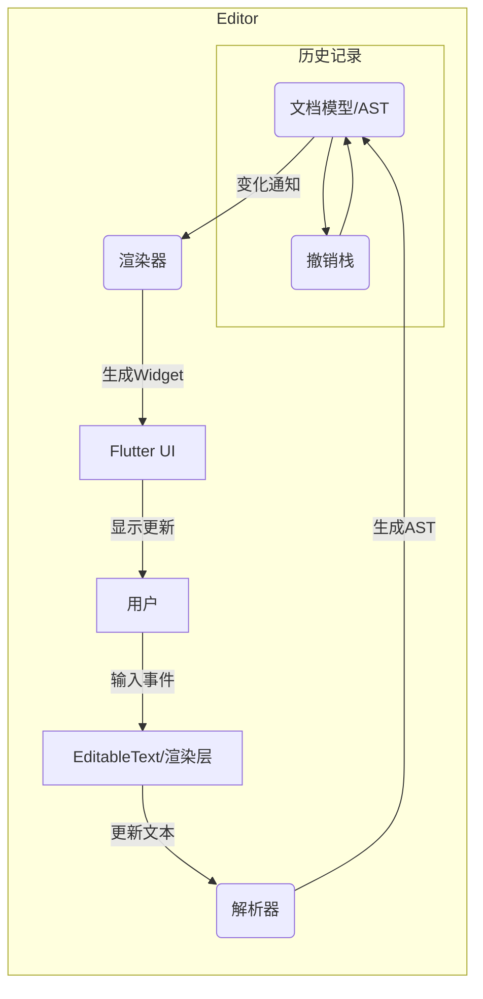
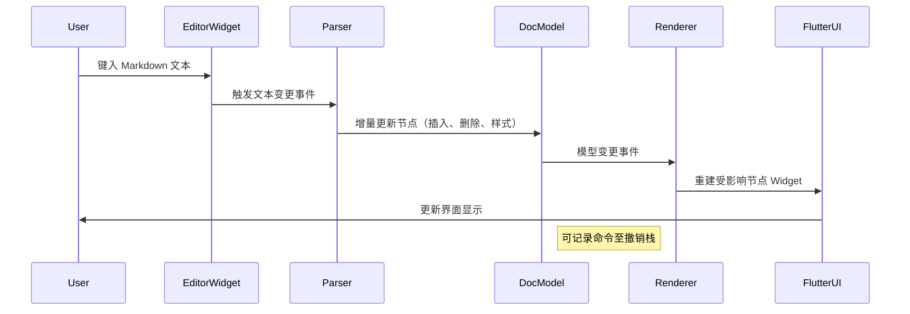

# Flutter/Dart 平台Markdown 编辑器技术方案

本报告针对 Flutter/Dart 平台上重写所见即所得 Markdown 编辑器提出全面技术方案。总体需求涵盖实时渲染、表格/公式/脚注/代码块/图片支持，以及剪贴板、拖拽、导入导出等功能，并考虑协同编辑需求和多平台适配（iOS/Android/Web/Desktop）。架构上建议将系统划分为**解析器**、**文档模型**、**渲染器**、**编辑层(UI)**、**状态管理(撤销/重做)**、**事件/命令层**与**插件/主题模块**等。其中，文档模型采用类似 Slate 的树形节点结构组合 Quill Delta 的方式【106†L1-L4】；解析器可复用 Dart 的 Markdown 库并增量解析扩展 GFM（表格、任务列表等）和数学脚注语法；渲染层基于 `EditableText`/`RenderEditable` 实现行内和块级渲染，并通过 `RichText` 或自定义 `WidgetSpan` 支持多样内容；编辑层负责光标管理和交互。撤销/重做建议采用命令模式或操作变换，协同编辑可选用 OT/CRDT 框架（如基于 Y.js 的实现）。性能优化包括文档分块渲染、输入节流、内存池化等。扩展性方面，提供插件接口和渲染钩子，允许新增节点类型和主题自定义。测试方面，需编写单元/集成测试，设计性能基准场景（大文档输入与渲染延迟）。报告最后给出示例代码片段、Mermaid 架构图和时序图，以及分阶段实施计划与估算。  

## 1. 总体目标与需求

- **功能范围**：所见即所得编辑，要求**实时双向渲染**（编辑器内直接显示格式化结果）；支持**Markdown 扩展语法**：表格、数学公式（LaTeX）、脚注、GFM 任务列表/引用等；支持**代码块高亮**、图像插入（可拖拽、粘贴）、超链接、列表和标题等。应支持**剪贴板操作**（剪切/复制/粘贴）和**拖放**插入本地/网络资源。需考虑**导入/导出**功能，如将文档导出为 Markdown、HTML 或 PDF。若需要，可设计**协同编辑**（即多用户实时编辑）架构（见第5项）。  
- **平台**：覆盖移动端（iOS/Android）、Web 和桌面平台（Windows/macOS/Linux）。采用 Flutter 原生 UI，无需依赖 WebView。界面元素（工具栏、悬浮菜单）应能跨平台一致显示。  
- **性能目标**：能够流畅处理大文档（如**≥10 万行文字或数十万字符**），交互延迟控制在**毫秒级**（输入渲染响应时间<50ms）。滚动和渲染应支持“虚拟化”，避免一次性渲染全部节点。内存占用需尽量优化，避免频繁 GC。总体目标是**用户输入无明显卡顿**，在复杂文档下保持高响应性和低滞后。  

## 2. 架构设计

- **模块划分**：建议将编辑器分为以下核心模块：  
  
  - **解析器(Parser)**：将 Markdown 文本转为中间表示。可基于 Dart 的 `markdown` 包（https://pub.dev/packages/markdown）或自行实现增量词法分析。输出**AST**或**Delta**格式。  
  - **文档模型(Document Model)**：维护当前文档的结构化表示。可采用**树状节点+Delta**混合模型【106†L1-L4】：每个非文本节点（段落、标题、列表等）为一棵树节点，文本节点内部以 Quill Delta 存储文本和属性。【106†L1-L4】  
  - **渲染器(Renderer)**：根据文档模型构建 Flutter Widget 树。实现行内（文本样式、链接、代码片段）和块级（段落、表格、列表）渲染。基于 `EditableText`/`RenderEditable` 或 `RichText` 实现文本展示，使用 `WidgetSpan` 嵌入特殊内容（如图像、公式）。负责**虚拟化渲染**：只渲染视口内可见节点，其他节点延迟加载。  
  - **编辑层(UI)**：Flutter Widget 级代码，包括工具栏、菜单、输入框容器等。核心是一个或多个 `EditableText` 实例，用于接收输入。编辑层监听用户输入事件，调用文档模型与渲染器更新。负责焦点管理、光标显示，以及键盘、鼠标事件处理。  
  - **状态管理**：维护编辑历史和撤销/重做操作。可采用**命令模式**：用户每次操作（插入、删除、样式修改等）封装成命令并入栈，支持 undo/redo；或使用**变换操作**（如 Quill 的 Delta 历史）进行状态回退。  
  - **事件/命令层**：处理用户触发的命令（如格式化命令、输入事件、快捷键）。将事件转为模型变化，如将粗体命令应用到模型。  
  - **插件/扩展点**：预留接口以添加新功能，比如自定义节点（表格、图表）、额外语法支持（Mermaid 图表）、第三方工具集成等。插件可以注入解析规则、渲染器或工具栏按钮。  
  - **样式/主题**：支持主题定制（深色/浅色模式），可采用 Flutter 主题系统或 CSS-like 样式表。应支持用户自定义样式表（字体、间距、颜色）。  
  - **存储/同步**：文档持久化（本地文件或云端），导入导出功能（Markdown/HTML/PDF）。如果支持协同，需实现数据同步模块（见第5项）。  

- **模块接口**：各模块之间通过中间数据格式交互。解析器输出**中间表示**（AST/Deltas）并传递给文档模型；文档模型变化时触发渲染更新。渲染器接收文档模型节点，生成 Flutter Widget。编辑事件通过命令模式修改模型。可使用事件总线或回调机制连接组件。  

- **数据契约示例**：推荐使用类似 Slate 的 JSON AST，每个节点包括 `type`, `attrs`, `children`，文本节点可包含 `text` 和 `styles` 等属性。示例：  
  
  | 字段         | 含义               | 示例值                                        |
  | ---------- | ---------------- | ------------------------------------------ |
  | `type`     | 节点类型（段落、标题、列表等）  | `"paragraph"`                              |
  | `attrs`    | 节点属性（标题级别、列表类型等） | `{"level": 2}`                             |
  | `children` | 子节点列表            | `[ {...}, {...} ]`                         |
  | `text`     | 文本内容（仅对文本节点有效）   | `"示例文本"`                                   |
  | `styles`   | 文本样式标记（粗体、链接等）   | `[{"offset":0,"length":2,"style":"bold"}]` |

## 3. 解析器策略

- **基础解析**：可以复用 Flutter 官方的 [`markdown`](https://pub.dev/packages/markdown) 包实现基础 Markdown 语法解析，将用户输入的 Markdown 文本解析为 AST。该包支持常见元素（标题、列表、代码块）。由于需要实时反馈，应设计**增量解析**：仅解析光标所在段落或被修改的部分。可跟踪文本编辑控制器（`TextEditingController`）的变动范围，并只对该范围重新解析，从而提高性能。  

- **扩展语法**：自定义规则支持 GFM：如**表格**（`|`分隔）、**任务列表**（`- [ ]`）、**自动链接**等；**数学公式**可解析 LaTeX 语法（`$...$`、`$$...$$`）使用 KaTeX/MathJax 风格，渲染为图片或 MathML；**脚注**（`[^id]`）等。解析器可以基于正则或 PEG 实现相应规则，或借助社区库。示例：  
  
  ```dart
  // 增量解析伪代码：只解析当前段落
  void onTextChanged(String fullText, TextRange changedRange) {
    final paragraph = extractParagraph(fullText, changedRange);
    final ast = markdownToAst(paragraph);
    documentModel.updateParagraph(nodeId, ast);
  }
  ```

- **Muya 规则移植**：可参考 MarkText/Muya 项目中对 GFM 和扩展语法的实现【37†L306-L310】（需要注意标点和关键字处理）。Muya 源码在 `inlineRenderer` 模块中定义了许多规则，可借鉴其关键思想（注意许可协议）。  

- **错误容错**：解析器应处理不完整语法（如输入中途），避免抛错，可采用容忍解析或部分渲染策略。  

## 4. 渲染器与编辑层实现

- **渲染方案**：使用 Flutter 的文本渲染核心。可以将每个块级节点渲染为一个 `RichText` 或定制 `WidgetSpan` 容器。例如，段落渲染为 `RichText(text: TextSpan(children: [...]))`，列表渲染为多个 `RichText` 组成的列。代码块和公式可用等宽字体或 `Image` 显示。  

- **行内 vs 块级**：**行内元素**（强调、链接、内联代码）在同一 `TextSpan` 内通过样式属性表现；**块级元素**（段落、表格、列表）可封装在独立 Widget 。图像、媒体可用 `WidgetSpan` 嵌入于 `RichText`。表格可构建为 `Table` Widget 逐单元渲染。  

- **增量重绘**：只更新修改的节点。可跟踪文档模型中被编辑的节点，调用 `setState` 仅重建该节点的 Widget。避免全局重建。  

- **虚拟化**：对于大文档，在滚动时可使用 `ListView.builder` 或 `CustomScrollView` 结合 `SliverList` 逐块渲染，超出视口的节点不渲染。自定义渲染器需计算每个节点在屏幕中的位置，卸载屏幕外节点的 Widget，保存状态以提高性能。  

- **光标和选区映射**：Flutter 的 `TextSelection` 自带管理，但在自定义渲染时需将模型位置映射到 UI 坐标。例如，对应模型中的 (nodeId, offset) 转换为 `TextPosition`。可使用 `RenderParagraph.getBoxesForSelection` 获取精确坐标。插入/删除操作后，应重定位光标至正确位置。  

- **Widget 示例**：  
  
  ```dart
  // 渲染段落节点为 RichText
  Widget buildParagraph(ParagraphNode node) {
    return RichText(
      text: TextSpan(
        children: node.children.map((child) {
          if (child.type == 'text') {
            return TextSpan(text: child.text, style: child.style);
          } else if (child.type == 'link') {
            return TextSpan(text: child.text, style: linkStyle);
          } // 更多类型...
        }).toList(),
      ),
    );
  }
  ```

## 5. 文档模型与协同编辑

- **文档模型**：使用**不可变树形结构**。如 AppFlowy 所述，节点模型方便描述嵌套结构，每次修改生成新节点【106†L1-L4】。结合 Delta 存储文本变动，便于实现拆分和合并。**示例中间表示**：各节点 JSON 中记录子节点关系、属性和内联样式。  

- **撤销/重做**：可记录操作序列。常用实现有**命令模式**（每个编辑操作封装成可逆命令存栈）或**操作变换(OT)**。使用命令模式时，每次插入、删除、格式更改等都记录描述改动的对象，调用 undo/redo 时应用逆操作。也可借鉴 FlutterQuill 的 history 功能，将文本变化记录为 Delta 并支持回退。示例命令：  
  
  ```dart
  class InsertTextCommand {
    final Node node;
    final int offset;
    final String text;
    InsertTextCommand(this.node, this.offset, this.text);
    void execute() { /* 插入 text 于 node.offset */ }
    void undo() { /* 删除之前插入的 text */ }
  }
  ```

- **协同编辑**：Flutter 社区暂无现成协同框架，但可使用 CRDT/OT 方案。可选择基于 **Y.js** 或 **Automerge** 的跨平台后端支持，前端负责将本地模型变动广播到服务器并融合远端操作。若使用如 Delta 数据结构，可集成类似 Quill 的 OT 算法。协同实现需后端服务支持 WebSocket。风险在于延迟和合并冲突，缓解措施包括：限制多用户同时编辑范围、使用操作排队、定期保存快照。  

## 6. 性能优化

- **大文档分块**：将文档分为多段或块，按需渲染。使用懒加载组件（`ListView.builder`）按需生成 Widget。  
- **增量更新**：输入时仅重新渲染受影响节点。使用 Debounce 函数节流连续输入事件（如 50ms 延迟触发解析）。合并快速连续操作以减少重绘频率。  
- **虚拟化**：超出视口范围的节点销毁渲染缓存，仅保存模型。滚动时动态生成进入屏幕的节点。这降低内存占用。  
- **GC 考量**：尽量复用对象，如使用 `TextSpan` 缓存相同样式。对重复内容启用共享样式和文本缓存，减轻 Dart GC 压力。  
- **平台差异**：在 Web 环境，使用 `CanvasKit` 渲染或 `flutter_html` 插件处理复杂布局；在移动端可使用 GPU 加速的 `RichText`。关注不同平台的输入法和剪贴板差异。  

## 7. 可扩展性与插件机制

- **语法扩展**：设计插件接口，在解析阶段可注册新的语法规则和渲染器。例如，可为表格、Mermaid 图表自定义插件，将语法扩展为节点类型。插件可提供自己的解析器和对应渲染 Widget。  
- **渲染钩子**：允许在渲染过程中插入自定义内容，如在特定节点上方添加额外 UI（工具栏、注释）。可通过监听模型构建阶段或 `WidgetSpan` 嵌入实现。  
- **主题与样式**：支持可插拔的主题引擎，如用户自定义 CSS 或 Flutter 主题数据，应用于所有文本和控件。  
- **API示例**：假设提供文档 API：  
  
  ```dart
  class EditorPlugin {
    Widget buildToolbar(EditorController controller);
    Node parseCustomSyntax(String text);
    Widget renderCustomNode(Node node);
  }
  ```
  
  用户可实现 `EditorPlugin` 来增加功能。  

## 8. 测试、质量与 CI/CD

- **测试策略**：  
  - **单元测试**：解析器输出正确的 AST（包括扩展语法）、命令执行前后状态匹配。  
  - **集成测试**：在不同文本编辑场景下模拟输入，验证渲染结果（可使用 Golden 图像测试）。  
  - **端到端测试**：通过 Flutter Integration Tests 模拟用户交互，如输入 Markdown 语法，检查 UI 显示。  
  - **性能基准**：编写基准测试场景：如加载并滚动 50 万字符文档、持续输入大文本，测量渲染延迟与帧率。  
- **自动化**：使用 `flutter test` 与 `integration_test`，CI/CD 可配置 GitHub Actions。性能测试可集成 `flutter_driver` 测速。每次提交后自动运行测试套件并报告性能回归。  

## 9. 迁移与兼容

- **与现有编辑器兼容**：可借鉴 `flutter_quill` 和 `super_editor` 的数据模型与 API 设计。例如，提供 Quill Delta 的导入导出，方便将老文档迁移到新格式。  
- **互操作策略**：如果已有使用 `flutter_quill`，可设计转换工具，将 Quill 的 Delta 转换为本编辑器的节点树，反之亦然，平滑过渡。对外提供统一的 Document API。  
- **生态整合**：可考虑作为 `markdown_editor_live` 等轻量库的增强版，结合其简单易用性和本系统的扩展性。  

## 10. 实施计划与估算

- **阶段一：原型与核心功能（2–3 个月）**  
  - 架构搭建：定义文档模型和基本 API。  
  - 基础解析：集成 `markdown` 包，实现段落、列表、链接、样式解析。  
  - 文本渲染：实现基本的 `EditableText` 编辑和 `RichText` 渲染，支持输入和光标移动。  
  - **交付物**：可编辑文本原型，基本语法支持。  
- **阶段二：功能完善与优化（2–3 个月）**  
  - 扩展语法：添加表格、代码块、脚注、数学等解析和渲染支持。  
  - UI 完善：工具栏、悬浮菜单、图片插入功能。  
  - 性能优化：实现增量渲染、虚拟化滚动。  
  - **交付物**：完整功能原型、性能基准报告。  
- **阶段三：测试与发布（1–2 个月）**  
  - 完善测试：补充单元/集成测试，CI 流程。  
  - 稳定性调优：修复已知问题，优化内存。  
  - 文档与示例：撰写使用手册和示例。  
  - **交付物**：发布版 SDK，持续集成配置。  
- **人员与成本**：团队至少需熟悉 Flutter/ Dart 的工程师（2–3 人）。按照每阶段约 3 人月估算，总开发时间约 6–8 个月。风险包括解析复杂语法和性能瓶颈，需预留充足测试与优化时间。  





**性能基准测试示例**（场景/输入规模/指标）：  

- 大文档编辑：输入含 10 万字 Markdown，测量每次字符输入至渲染完成的延迟（目标<50ms），以及内存占用。  
- 高度格式文档：含多表格、图片文档，模拟滚动和复制粘贴大段文本，测量帧率与内存峰值。  
- 协同编辑模拟：多用户同时编辑文档，测量同步延迟和冲突率。  

**关键代码片段示例**：  

```dart
// 扩展 TextEditingController 以支持 Markdown 解析
class MarkdownController extends TextEditingController {
  void onTextChanged(String text) {
    final changes = detectChanges(text); // 检测改动区间
    final ast = parseMarkdown(text, range: changes);
    documentModel.update(ast);  // 更新文档模型
  }
}
```

```dart
// 渲染示例：将段落节点构建为 RichText Widget
Widget buildParagraph(Node paragraph) {
  return RichText(
    text: TextSpan(
      style: baseStyle,
      children: paragraph.children.map((node) {
        if (node.type == 'text') {
          return TextSpan(text: node.text, style: node.textStyle);
        } else if (node.type == 'link') {
          return TextSpan(text: node.text, style: linkStyle, recognizer: TapGestureRecognizer()..onTap=(){...});
        }
        // ... 更多内联类型
      }).toList(),
    ),
  );
}
```

```dart
// 撤销/重做命令示例
class FormatCommand {
  final Node node; final TextStyle style;
  FormatCommand(this.node, this.style);
  void execute() { node.applyStyle(style); }
  void undo() { node.removeStyle(style); }
}
// 使用时：编辑器记录每次 FormatCommand 并入栈。
```

```json
// 示例中间表示：节点树结构
[
  {
    "type": "document",
    "children": [
      {
        "type": "header",
        "attrs": {"level": 2},
        "children": [{"type":"text","text":"标题"}]
      },
      {
        "type": "paragraph",
        "children": [
          {"type":"text","text":"示例段落","styles":[{"offset":0,"length":2,"style":"bold"}]},
          {"type":"link","text":"点击","attrs":{"href":"https://flutter.dev"}}
        ]
      }
    ]
  }
]
```

综合以上设计，通过模块化架构、使用 Flutter 原生渲染能力和成熟组件（如 `flutter_quill`、`super_editor`）的思想，可以实现一个高性能、可扩展的 Flutter 所见即所得 Markdown 编辑器【106†L1-L4】【113†L1-L4】。报告提供了从需求到实现的完整技术蓝图，并给出了代码示例、时序/架构图和性能测试建议，为开发团队参考实施。